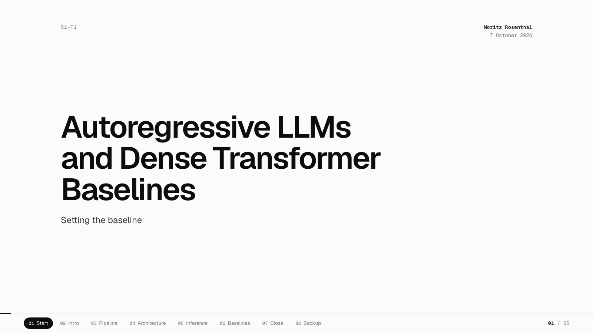
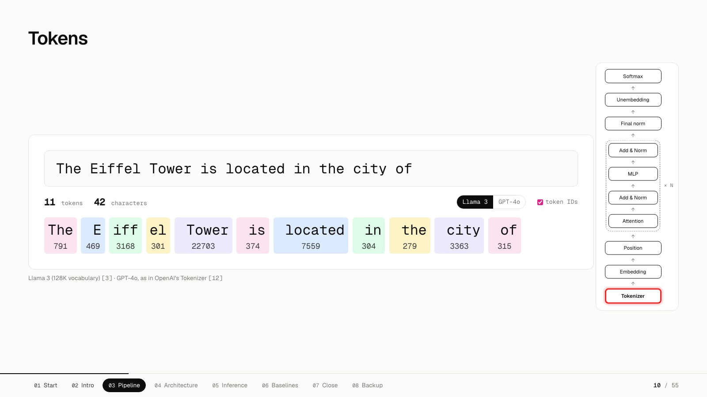
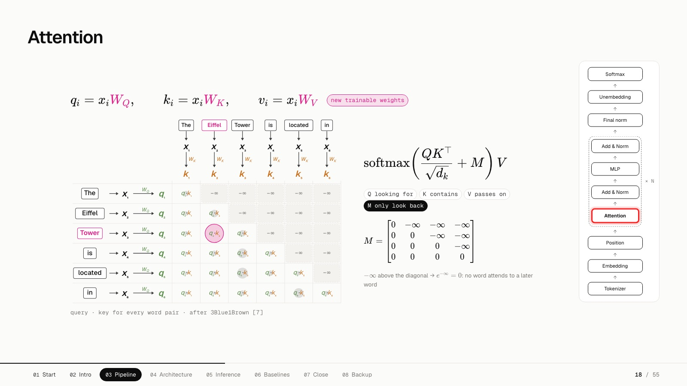
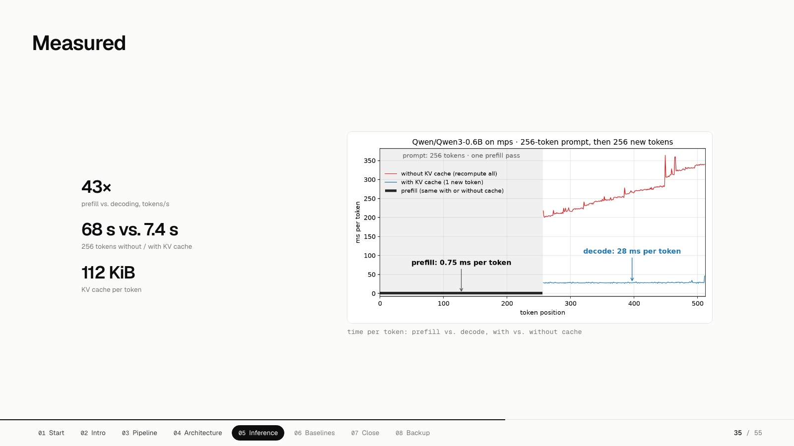
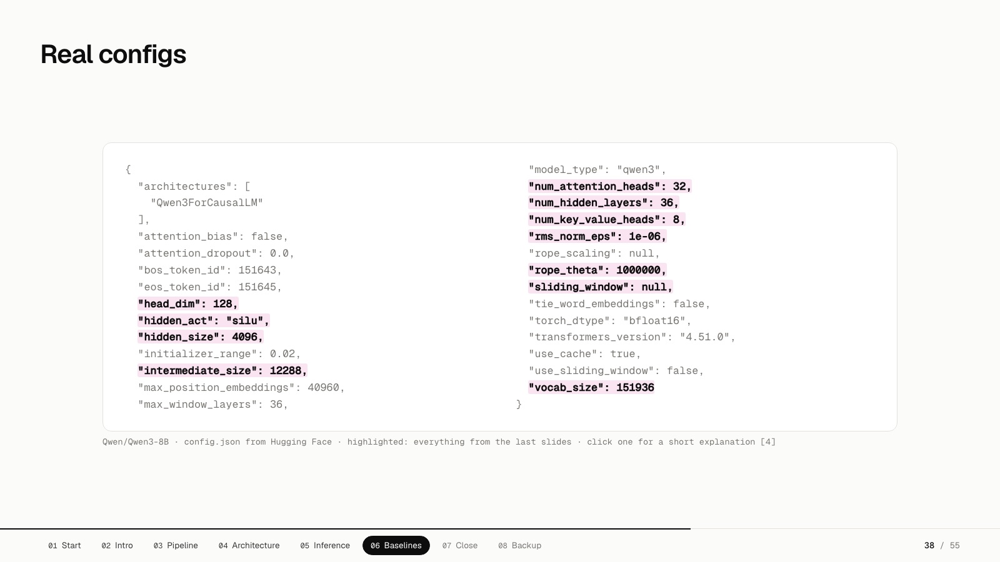
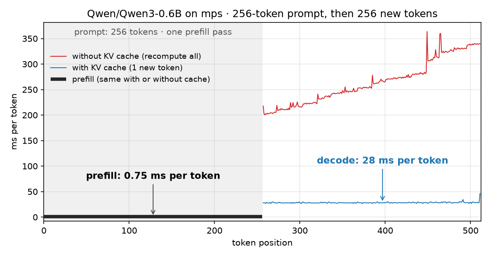

# Autoregressive LLMs and Dense Transformer Baselines

**[▶ Open the slides](https://moritz-rsth.github.io/seminar-tum-autoregressive-llms-s1t1/)** · 55 slides · one self-contained HTML file · works offline

The opening talk (S1-T1) of the TUM *LLM Architectures and Inference* seminar, given on 7 October 2026. It follows one sentence, *"The Eiffel Tower is located in the city of ___"*, through a decoder-only Transformer: tokenizer → embedding → position → attention → MLP → norm → unembedding → softmax → *Paris*. It then shows that Llama 3, Mistral 7B and Qwen3 are the 2017 recipe with a few swapped parts.

[](https://moritz-rsth.github.io/seminar-tum-autoregressive-llms-s1t1/)

## What's inside the deck

| | |
|---|---|
| [](https://moritz-rsth.github.io/seminar-tum-autoregressive-llms-s1t1/) | **A live in-browser tokenizer.** Type any text and see the real Llama 3 and GPT-4o (`o200k_base`) tokens and IDs. Both BPE tokenizers are bundled into the page, with no server. |
| [](https://moritz-rsth.github.io/seminar-tum-autoregressive-llms-s1t1/) | **Attention, built up on one example.** It goes from query/key dot products and the causal mask to softmax and multi-head attention, with the math typeset by KaTeX at build time. |
| [](https://moritz-rsth.github.io/seminar-tum-autoregressive-llms-s1t1/) | **Measured on a laptop, not quoted from a paper.** With the KV cache, decode is about 9× faster. Prefill is 43× more efficient per token than decode. See [`experiments/`](experiments). |
| [](https://moritz-rsth.github.io/seminar-tum-autoregressive-llms-s1t1/) | **The real `config.json` of Qwen3-8B.** Every concept from the talk is highlighted, and you can click a field to get a short explanation. |

Navigate with **← / →** or **space**, or click the section pills at the bottom. The page is a single 7 MB HTML file with all images, fonts and scripts inlined, so you can download [`index.html`](index.html) and present it offline.

## Experiments

The inference part of the talk is backed by benchmarks I ran on an M1 Pro (Qwen3-0.6B, PyTorch, MPS):

| | result |
|---|---|
| Prefill throughput | ~1,500 tok/s (compute-bound, one big matmul) |
| Decode with KV cache | 35 tok/s, **flat** ~28 ms per step |
| Decode without KV cache | 3.8 tok/s, grows linearly from 204 ms to 339 ms per step |
| KV cache | 112 KiB per token (`2 · 28 layers · 8 KV heads · 128 · 2 B`), measured = formula |
| Cache vs. no cache | **identical** greedy output for all 256 tokens. The cache is exact, not an approximation |
| Sliding window (Mistral arch.) | caps the cache at the window, but makes prefill *slower* on eager PyTorch/MPS |

<p align="center"></p>

Full write-up, all tables and reproduction steps: **[experiments/README.md](experiments/README.md)**

## Repository layout

```
index.html            the deck (GitHub Pages serves it as the site root)
experiments/          configs, prefill vs. decode, KV cache, sliding window, 3D embeddings
  results/            raw JSON + console logs of the runs
  figures/            plots
deck-src/             the source the deck is built from
  s1t1_src.html       slides as HTML
  build.sh            LaTeX → KaTeX, inline tokenizers, inline every asset into one file
  scripts/            KaTeX build step, bundled js-tiktoken (o200k_base) + Llama 3 tokenizer
  assets/             images and plots used in the slides
```

The build uses the `slides` skill from [moritz-skills](https://github.com/moritz-rsth/moritz-skills) for the final inlining step.

## Papers

1. Grattafiori et al., [The Llama 3 Herd of Models](https://arxiv.org/abs/2407.21783), 2024
2. Vaswani et al., [Attention Is All You Need](https://arxiv.org/abs/1706.03762), 2017
3. Jiang et al., [Mistral 7B](https://arxiv.org/abs/2310.06825), 2023
4. Yang et al., [Qwen3 Technical Report](https://arxiv.org/abs/2505.09388), 2025

## Credits and license

Several figures are adapted from, or credited to, their original authors. These include 3Blue1Brown's *Deep Learning* series (ch. 5–7), Jia-Bin Huang (GQA), Adrian Tam (decoder-only diagram) and Wikimedia Commons photographers (CC BY-SA). The full list of 20 sources is on the *Sources* slide. These figures remain the property of their authors.

My own code (experiments and build scripts) is MIT-licensed. KaTeX and js-tiktoken are MIT-licensed by their authors. The Llama 3 vocabulary bundled in the deck is © Meta under the Llama 3 Community License.
