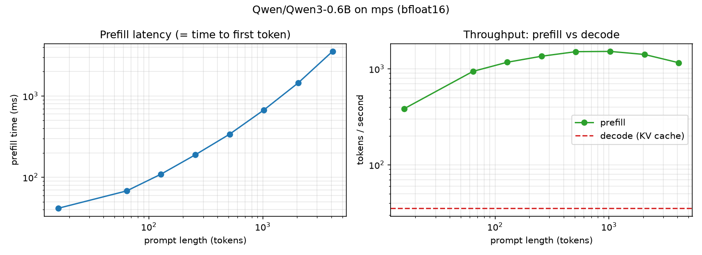
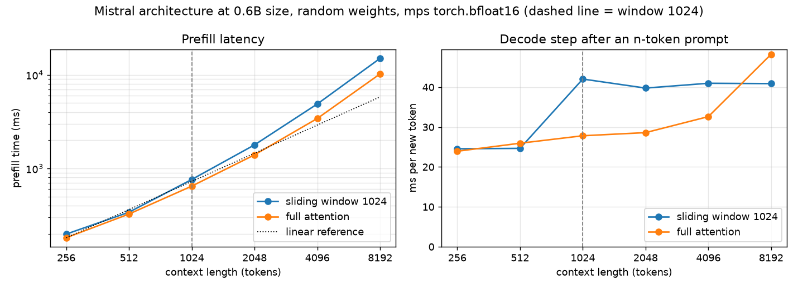

# Experiments: inside a dense Qwen3 checkpoint, prefill vs. decode, KV cache, sliding window

Syllabus task: *"Inspect a small dense Qwen3 or Llama checkpoint configuration and compare prefill with token-by-token decoding."*

Everything was measured on an Apple M1 Pro laptop (16 GB unified memory, macOS 26.6) with Python 3.14, torch 2.14 (MPS backend), transformers 5.17 and accelerate 1.15. Every number in the talk comes from these scripts.

## Files

| file | what it does |
|---|---|
| [`inspect_config.py`](inspect_config.py) | **A.** Downloads only the `config.json` files (a few KB each) plus the Qwen3 tokenizer. It compares the architectures, computes the parameter breakdown and the KV-cache size, and shows tokenization |
| [`prefill_vs_decode.py`](prefill_vs_decode.py) | **B.** Loads Qwen3-0.6B (bf16 on MPS) and measures prefill/TTFT, KV-cache shapes, and per-step decode latency with and without the cache |
| [`plot_decode_latency.py`](plot_decode_latency.py) | Redraws `decode_latency.png` from `results.json`. No model is needed |
| [`sliding_window.py`](sliding_window.py) | **C.** Builds the Mistral architecture at Qwen3-0.6B size and runs it with and without sliding-window attention |
| [`embed_3d.py`](embed_3d.py) | Rotatable 3D PCA of real Llama-architecture input embeddings (SmolLM2-135M), used for the "embedding space" backup slide |
| [`results/`](results) | Raw outputs from the runs on the machine above (`*.json` with every per-step latency, `*_output.txt` console logs, `cpu_run/`) |
| [`figures/`](figures) | The plots |

## Reproduce

```bash
cd experiments
python3 -m venv .venv
.venv/bin/pip install -r requirements.txt           # ~1.1 GB, 2-4 min

export HF_HOME="$PWD/hf_cache"                       # keep model files local
export HF_HUB_DISABLE_TELEMETRY=1

.venv/bin/python inspect_config.py                   # A: configs only, ~10 s
.venv/bin/python prefill_vs_decode.py --quick        # B: downloads Qwen3-0.6B once (~1.4 GB), then ~40 s
.venv/bin/python prefill_vs_decode.py                # B: full sweep, ~2.5 min
.venv/bin/python prefill_vs_decode.py --device cpu --quick   # optional CPU/fp32 comparison
.venv/bin/python sliding_window.py                   # C: random weights, no download
.venv/bin/python embed_3d.py                         # 3D embedding plot (SmolLM2-135M, ~270 MB)
```

The scripts write their JSON and PNG outputs to the current directory. The copies committed here were moved into `results/` and `figures/`.

`meta-llama/Llama-3.2-1B` is gated. To use it, you need a HF token and you have to accept the license first. When it is not available, `inspect_config.py` skips it with a `GatedRepoError`. Qwen3 and Mistral-7B-v0.1 (both Apache-2.0) are ungated.

---

## A. Configuration (from `config.json`)

| | Qwen3-0.6B | Qwen3-1.7B | Qwen3-8B | Mistral-7B-v0.1 |
|---|---|---|---|---|
| layers | 28 | 28 | 36 | 32 |
| hidden | 1024 | 2048 | 4096 | 4096 |
| FFN intermediate | 3072 | 6144 | 12288 | 14336 |
| Q heads / KV heads (GQA ratio) | 16 / 8 (2) | 16 / 8 (2) | 32 / 8 (4) | 32 / 8 (4) |
| head_dim | 128 | 128 | 128 | 128 |
| vocab | 151936 | 151936 | 151936 | 32000 |
| max positions | 40960 | 40960 | 40960 | 32768 |
| rope_theta | 1e6 | 1e6 | 1e6 | 1e4 |
| tied embeddings | yes | yes | no | no |
| activation | SiLU (SwiGLU) | SiLU | SiLU | SiLU |
| sliding window | none | none | none | 4096 |
| params (analytic) | 596.0 M | 1.721 B | 8.191 B | 7.242 B |
| embedding share | 26 % | 18 % | 15 % (emb + head) | 3.6 % |
| MLP share | 44 % | 61 % | 66 % | 78 % |
| KV cache / token (bf16) | 112 KiB | 112 KiB | 144 KiB | 128 KiB |
| KV cache @ 2K / 8K / 32K | 0.22 / 0.88 / 3.5 GiB | same | 0.28 / 1.13 / 4.5 GiB | 0.25 / 1.0 / 4.0 GiB |

* The analytic parameter count (596.0 M) matches `sum(p.numel())` of the loaded model exactly.
* In Qwen3-0.6B, `num_heads × head_dim = 2048` is not equal to `hidden = 1024`. The head dimension is decoupled from d_model.
* Without GQA (full MHA), the 32K cache would be 7 GiB for Qwen3-0.6B and 18 GiB for Qwen3-8B, which is more than this laptop's RAM.

## B. Prefill vs. decode (Qwen3-0.6B, bf16, MPS)



| prompt tokens | prefill = TTFT (ms) | prefill throughput (tok/s) |
|---|---|---|
| 16 | 41 | 385 |
| 128 | 109 | 1,171 |
| 512 | 339 | 1,510 |
| 1024 | 674 | 1,519 |
| 4096 | 3,537 | 1,158 |


| 256-token prompt → 256 new tokens, greedy | per-step latency (first 10 / last 10) | decode tok/s | wall time |
|---|---|---|---|
| **with KV cache** | 27.9 ms / 30.5 ms (flat) | **35.2** | 7.4 s |
| **without cache** (recompute everything) | 204 ms / 339 ms (grows linearly) | **3.8** | 67.8 s |
| `model.generate()` (reference) | | 33.8 | 7.6 s |

* The greedy tokens were **identical** with and without the cache for all 256 steps. The KV cache is an exact optimisation, not an approximation.
* Prefill peaks around 1,520 tok/s, while cached decode runs at about 35 tok/s. That makes prefill **about 43 times** more efficient per token.
* KV cache shape per layer: `(1, 8 KV heads, seq, 128)` for 16 query heads. The measured 112 KiB per token matches `2 · 28 · 8 · 128 · 2 B`.

**Why:** prefill pushes all prompt tokens through each weight matrix as one matrix-matrix multiply, so it is compute-bound. Each decode step reads all ~1.1 GiB of weights to produce a single token (a matrix-vector product), so it is bound by memory and latency. Without the cache, every step is a fresh prefill of the growing sequence, and the total cost becomes quadratic.

## C. Does sliding-window attention make Mistral faster?

Mistral-7B does not fit a 16 GB laptop in bf16. The script therefore builds the Mistral architecture at Qwen3-0.6B size with random weights, because speed depends only on the tensor shapes. The same model then runs with `sliding_window=1024` and with full causal attention.



| context | prefill, window (ms) | prefill, full (ms) | decode, window (ms) | decode, full (ms) | KV kept (window) |
|---|---|---|---|---|---|
| 1024 | 761 | 646 | 42.0 | 27.8 | 1023 |
| 4096 | 4,882 | 3,416 | 41.0 | 32.6 | 1023 |
| 8192 | 14,989 | 10,231 | 40.9 | 48.3 | 1023 |

The sliding window caps the KV cache at 1023 tokens, so decode cost stays flat while full attention keeps growing (they cross over between 4K and 8K). In this eager PyTorch/MPS setup, however, prefill with the window was *slower* at every length. The most likely reason is that the window is applied as an explicit mask and not as a kernel that skips the out-of-window blocks. The memory saving is real. A speedup would need a kernel that actually exploits the window, such as FlashAttention's local attention.

## CPU fallback

With `--device cpu --quick` (fp32), a 1024-token prefill takes 840 ms (1,219 tok/s). Decode with the cache runs at 94 ms per step (10.6 tok/s). The MPS GPU is about 3.4 times faster than the CPU at decode, but only about 1.25 times faster at long prefill. The plots are in `figures/cpu_*.png`.

Timings vary by about ±10 % between runs.
